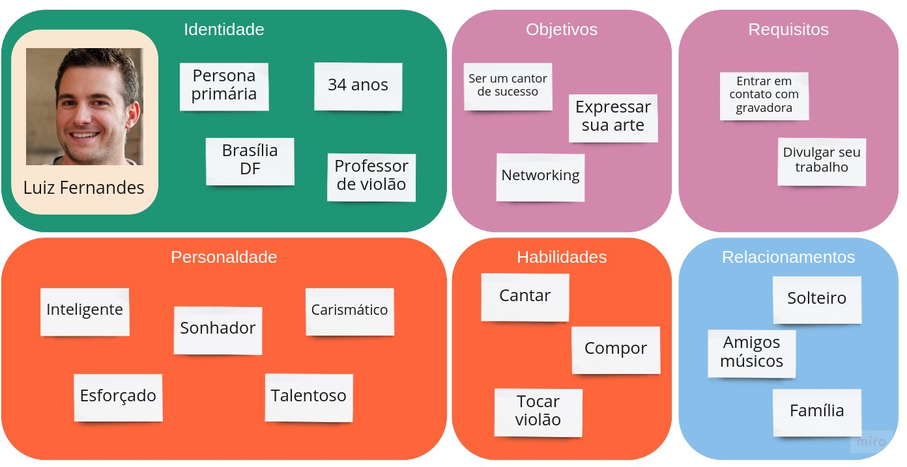
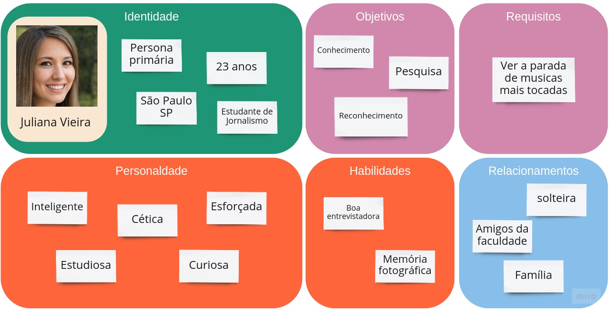
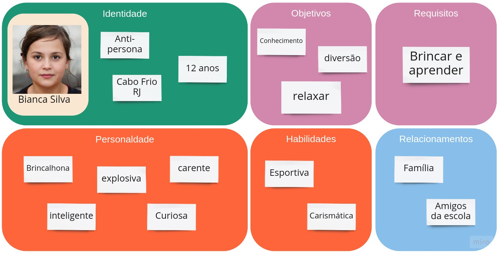

# Perfil do Usuário

## 1. Introdução

O perfil de usuário é uma descrição das características do usuário a qual o sistema será voltado, sendo assim indispensável para que conhecermos melhor o público alvo, além de ajudar no recrutamento dos participantes em atividades de análise e avaliação futuras (Courage e Baxter, 2005; Hackos e Redish, 1998). Além disso, as características descritas nele podem ser pensadas de acordo com as maiores necessidades do sistema, para que assim não tenha um excesso de informação a qual pode atrapalhar o escopo do projeto.
  
Sendo assim, para o site “Musikcity”, que é voltada para artistas do ramo musical ou amantes de música em geral, o perfil de usuário se define em artistas com idade maior do que 18 anos, de ambos os sexos, com educação básica e experiência razoável em computadores. Eles também devem ter um conhecimento musical considerável, visto que querem ser contratados por uma gravadora ou gravar suas composições. Tendo isso em vista, os artistas utilizarão o site para poder contratar o serviço de divulgação ou gravação de arranjo, sendo uma tarefa que se faz uma única vez, sendo os outros passos da contratação de serviços feita por outros meios, como pessoal, telefone ou e-mail.
  
Além disso, o site (pelo fato de ter um escopo muito grande e variado) também tem outro perfil de usuário de usuário, que é definido por qualquer pessoa, independente de sexo ou idade, com educação básica e conhecimento razoável em computadores, que conhecem musica pelo meio de mídia e rádio, sem necessariamente ter conhecimento teórico musica. Com isso, eles utilizarão o site para ver as paradas de sucesso do Brasil e dos Estados Unidos, e também escutar rádios do brasil inteiro, sendo uma tarefa que pode ser feita sem número limitado de vezes nem um tempo determinado, com o objetivo de adquirir conhecimento da mídia mainstream ou apenas escutar música.

## 2. Personas

### 2.1 Introdução

Uma persona é um personagem fictício que representa um arquétipo de um grupo de usuários, que tem como objetivo descrever um usuário padrão de um sistema. As personas tem como objetivo principal alinhar os desenvolvedores e os stackholders em qual é o usuário final da aplicação.

Todas as fotos das personas foram tiradas do site <i> This Person Does Not Exist</i>.

### 2.2 Personas do Musikcity

Sendo assim, desenvolvemos 3 personas diferentes, sendo elas voltadas em cada uma das tarefas principais que serão o foco do projeto: 

- Escutar rádio;
- Divulgação de artistas;
- Paradas musicais.
 

A primeira persona representa um jovem artista que pretende encontrar um contrato com uma grávadora, procurando o site com o objetido de divulgação.

*Figura 1 -  Persona 1 (Divulgação de artistas), Autoria própria*

A segunda persona representa um jovem que quer escutar musica e descobrir musicas novas,  procurando o site com o objetivo de escutar rádio.

*Figura 2 -  Persona 2 (Escutar rádio), Autoria própria*

A terceira persona representa uma jovem que quer descobrir quais são as músicas mais tocadas pelo brasil,  procurando o site com o objetivo de ver as paradas de sucesso.

*Figura 3 -  Persona 3 (Paradas de sucesso), Autoria própria*

A próxima persona representa uma anti-persona, isto é, uma pessoa que está completamente fora do usuário do site, nesse caso ela se encontra nessa categoria por ser uma criança, a qual o site não é voltado.

*Figura 4 -  Anti-persona, Autoria própria*

## 3. Bibliografia 

>Barbosa, S. D. J.; Silva, B. S. da; Silveira, M. S.; Gasparini, I.; Darin, T.; Barbosa, G. D. J. (2021) Interação Humano-Computador e Experiência do usuário. Autopublicação.

## 4. Versionamento
Versão|Data      |Modificação          |Autor
------|----------|---------------------|--------
1.0   |29/08/2021|Criação da wiki      | Eduarda Tavares
1.1   |30/08/2021|Criação do conteúdo  | Artur de Sousa
1.2   |30/08/2021|Adição do conteúdo   | Mariana Rio
1.3   |06/09/2021|Atualização da página| Artur de Sousa
1.4   |03/10/2021|Verificação          | Mariana Rio