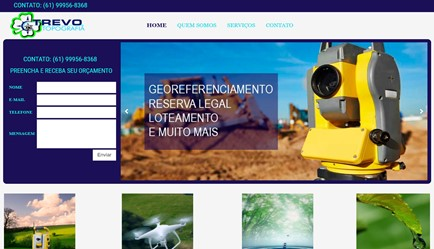
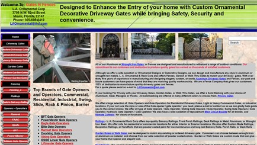
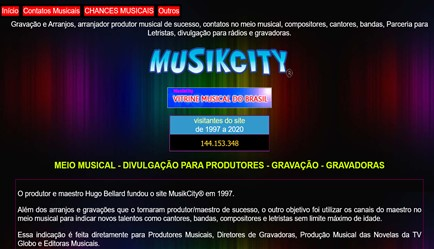
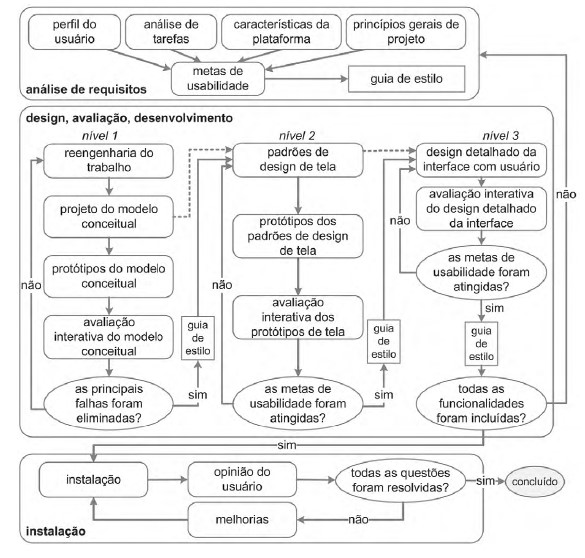
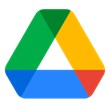
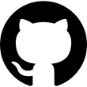
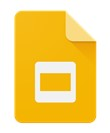

# Planejamento

## 1. Sites Avaliados

### Trevo Topografia

Link: [Trevo Topografia](https://www.trevotopografia.com/)

### Gates N Fences

Link: [Gates N Fences](http://gatesnfences.com/index.html)

## 2. Site Escolhido

### Musik City

Link: [Musik City](https://musikcity.mus.br/)

## 3. Cronograma de Atividades 

Tarefa      |Participantes |Data de Entrega
--------------  |----------|------
Perfil do usuário, Personas e Análise de tarefas.|Artur de Sousa e Pedro Hinrique|28 de agosto
Princípios Gerais de Projeto, Metas de usabilidade, Guia de Estilo.|Eduarda Tavares e Mariana Rio|4 de setembro 
Planejamento da Avaliação e do relato dos resultados da avaliação do Storyboard e Análise de tarefas.Mariana Rio.|Todos|8 de setembro 
Relato dos resultados do Storyboard, Análise de tarefas e o Planejamento da Avaliação e do relato dos resultados da avaliação do Protótipo de Papel.|Todos|20 de setembro

## 4. Processo de Design

Nosso processo de design detalha as atividades básicas do design, através de uma análise da situação atual, da síntese de uma intervenção e da avaliação dessa intervenção projetada (Barbosa e Silva, 2010).

*Figura 1 -  Ciclo de Mayhew, BARBOSA, Simone et al. "Interação Humano-Computador". 2010. p. 110.*

●	Análise de requisitos: Essa etapa traz as metas de usabilidade que são identificadas através dos perfis do usuário, da análise de tarefas, das características da plataforma e do projeto. (Barbosa e Silva, 2010)

●	Design, avaliação e desenvolvimento: Tem como objetivo chegar a uma solução de IHC que cumpra com a análise de requisitos. (Barbosa e Silva, 2010)

●	Instalação: A partir da opinião do usuário busca-se aprimorar os pontos de melhoria que ainda faltam para completar a plataforma e o projeto como um todo. (Barbosa e Silva, 2010)

## 5.	Ferramentas Utilizadas

Ferramenta      |Nome |Descrição
--------------  |----------|------
  |Discord|Ferramenta utilizada para as reuniões do grupo.
 |Whatsapp|Ferramenta utilizada para a comunicação do grupo.
|Google Drive|Ferramenta utilizada para o armazenamento dos arquivos gerados para o desenvolvimento do projeto.
|Github|Ferramenta utilizada para documentação e controle de versionamento do projeto.
|Google Slides |Ferramenta utilizada para fazer os slides de apresentação do projeto na disciplina.

## 6. Bibliografia 
SIMONE DINIZ JUNQUEIRO BARBOSA, BRUNO SANTANA DA SILVA, Interação Humano-Computador, 1a Edição, Editora Campus, 2010. (Versão grátis disponível em: https://leanpub.com/ihc-ux)

## 7. Versionamento
Versão|Data      |Modificação        |Autor
------|----------|-------------------|--------
1.0   |16/08/2021|Criação da wiki    | Eduarda Tavares
1.1   |17/08/2021|Adição do conteúdo | Mariana Rio e Eduarda Tavares

